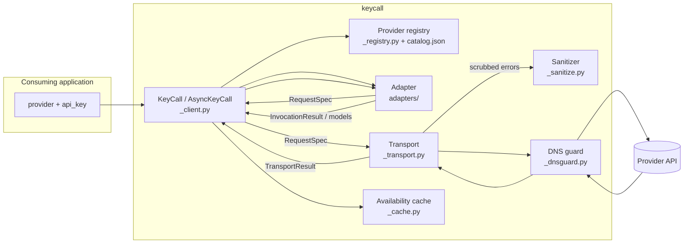

# Architecture

How KeyCall is put together: the layers a request passes through, the contracts between them, and the boundaries that keep credentials contained. For what the library does and how to call it, see [USAGE.md](https://github.com/shehuphd/keycall/blob/main/USAGE.md).

## Request flow



A call moves through four layers, each with one job:

1. The **client** binds identity (provider, credential, protocol, base URL) once at construction, drives pagination and caching, and owns tracing spans.
2. The **registry** resolves a provider name to a trusted endpoint profile from the bundled catalog, or validates an explicit custom target.
3. The **adapter** is pure: it turns a typed request into a `RequestSpec` (method, path, JSON body) and parses provider payloads back into normalized types. Adapters perform no I/O and never see the credential.
4. The **transport** executes specs over httpx, applies retry policy, caps response size, refuses redirects, and is the only layer that reveals the credential.

## Credential boundary

The raw key enters the library at exactly one point and is revealed at exactly one point:

```text
api_key (str)
  └─ KeyCall.__init__          wraps immediately in Credential (_credential.py)
       └─ Credential           redacted repr/str/format; refuses pickle/copy;
          .reveal()            called only by _transport._build_headers()
```

Everything between those two points handles the opaque `Credential` wrapper. Supporting rules:

- Adapters receive requests and payloads, never the credential.
- All provider-originated error text passes through `scrub()` (`_sanitize.py`) before entering a `KeyCallError`: the active credential and its URL-/base64-encoded forms are replaced, credential-shaped patterns are redacted, control characters are stripped, and length is bounded.
- Provider-supplied request identifiers pass through `safe_request_id()` before entering results or errors.
- Cache identity uses an HMAC fingerprint of the key under a process-local secret, never the raw key or an unkeyed digest.
- Clients and credentials refuse `pickle`, `copy`, and `deepcopy` outright.

## Component contracts

| Component | Owns | Must never |
|---|---|---|
| `_client.py` | Identity binding, page loop, cache use, tracing spans, category filtering | Expose the credential through any property or repr |
| `_registry.py` + `_catalog/catalog.json` | Name → endpoint/auth/operations resolution, custom-URL validation, per-provider capability evidence (tool calling, web search, schema enforcement, image forms, sampling constraints), each dated | Accept credential-routing data from outside the bundled catalog |
| `adapters/` | Request building, response parsing, error translation, model classification evidence | Perform I/O, see the credential, leak raw provider objects |
| `_transport.py` | HTTP execution, retries, size cap, redirect refusal, header construction | Retry generation, follow a redirect, emit unscrubbed provider text |
| `_dnsguard.py` | Per-request resolve-validate-pin for custom targets | Wrap named providers (their hostnames come from the catalog) |
| `_sanitize.py` | Credential scrubbing, request-id and display-name bounding | Depend on TraceAct for safety |
| `_cache.py` | Process-local TTL model cache keyed by provider + base URL + fingerprint | Persist to disk or outlive the process |
| `_verify_core.py` | The verify walk shared by CLI and viewer | Hide an attempt or fall through unreported |
| `_tracing.py` | Optional TraceAct spans with input capture forced off | Capture prompts, responses, or credentials |

## Provider resolution

Provider identity and wire protocol are separate. The catalog maps six named providers onto four protocols; the adapter is chosen by protocol, with named overrides for providers whose behavior diverges:

```text
provider name ──► catalog profile ──► protocol ──► adapter
  openai              openai            openai       OpenAIAdapter (Responses API)
  anthropic           anthropic         anthropic    AnthropicAdapter
  gemini              gemini            gemini       GeminiAdapter
  deepseek            openai-compatible              OpenAICompatibleAdapter
  moonshot            openai-compatible              OpenAICompatibleAdapter
  perplexity          openai-compatible              PerplexityAdapter (override)
  <custom> + base_url openai-compatible              OpenAICompatibleAdapter (is_custom)
```

An unknown name is an error unless the caller explicitly passes `protocol="openai-compatible"` with a validated HTTPS `base_url`. Custom targets get the DNS-rebinding guard; named providers route to catalog-maintained hostnames and do not.

## Retry policy

Operation-aware, implemented in the transport:

- `list`: up to 2 retries for retryable failures (transient network, 429, 5xx), backoff 0.5 s then 1.5 s, extended by `Retry-After` (seconds or HTTP-date form) up to 30 s.
- `generation`: zero retries. No supported provider documents generation idempotency, so a retry after ambiguous transmission could double-charge.
- Non-retryable errors (auth, permission, 4xx) raise immediately under either policy.

## The viewer

`keycall view` starts a localhost-only stdlib HTTP server (`viewer/_server.py`). Credentials stay server-side in a `Registry` (`viewer/_registry.py`) that maps integer target ids to live clients; the browser only ever sends and receives target ids and `TargetView` records. Every `/api/*` request requires a per-run token generated fresh at startup and never persisted. The frontend is dependency-free and builds DOM through `textContent` only, under a `default-src 'self'` content security policy.

```text
browser ── token + target id ──► _server.py ──► _api.py ──► Registry ──► KeyCall client
        ◄─ JSON (TargetView, models, results; never a key) ◄─
```

## Error taxonomy

One exception type, `KeyCallError`, discriminated by a closed `ErrorCode` enum (invalid key, permission, rate limit, provider outage, network, timeout, malformed response, unsupported provider/operation, model availability). Codes, retryability, and the full table are in [USAGE.md](https://github.com/shehuphd/keycall/blob/main/USAGE.md).
