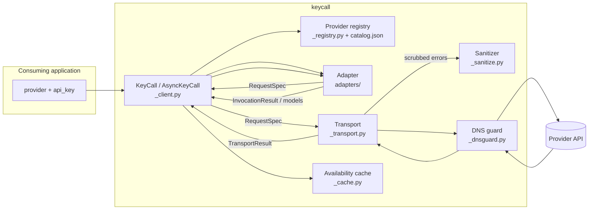

# Architecture

How KeyCall is put together: the layers a request passes through, the contracts between them, and the boundaries that keep credentials contained. For what the library does and how to call it, see [USAGE.md](https://github.com/shehuphd/keycall/blob/main/USAGE.md).

## Request flow



A call moves through four layers, each with one job:

1. The **client** binds identity (provider, credential, protocol, base URL) once at construction, drives pagination and caching, and owns tracing spans.
2. The **registry** resolves a provider name to a trusted endpoint profile from the bundled catalog, or validates an explicit custom target.
3. The **adapter** is pure: it turns a typed request into a `RequestSpec` (method, path, JSON body) and parses provider payloads back into normalized types. Adapters perform no I/O and never see the credential.
4. The **transport** executes specs over httpx, applies retry policy, caps response size, refuses redirects, and is the only layer that reveals the credential.

## Credential boundary

The raw key enters the library at a single point and is revealed at a single point:

```text
api_key (str)
  └─ KeyCall.__init__          wraps immediately in Credential (_credential.py)
       └─ Credential           redacted repr/str/format; refuses pickle/copy;
          .reveal()            called only by _transport._build_headers()
```

Everything between those two points handles the opaque `Credential` wrapper. Supporting rules:

- Adapters receive requests and payloads, never the credential.
- All provider-originated error text passes through `scrub()` (`_sanitize.py`) before entering a `KeyCallError`: the active credential and its URL-/base64-encoded forms are replaced, credential-shaped patterns are redacted, control characters are stripped, and length is bounded.
- Provider-supplied request identifiers pass through `safe_request_id()` before entering results or errors.
- Cache identity uses an HMAC fingerprint of the key under a process-local secret, never the raw key or an unkeyed digest.
- Clients and credentials refuse `pickle`, `copy`, and `deepcopy` outright.

## Component contracts

| Component | Owns | Must never |
|---|---|---|
| `_client.py` | Identity binding, page loop, cache use, tracing spans, category filtering | Expose the credential through any property or repr |
| `_registry.py` + `_catalog/catalog.json` | Name → endpoint/auth/operations resolution (text generation, embeddings, image generation, speech generation, video generation and status), custom-URL validation, per-provider capability evidence (tool calling, web search, schema enforcement, media input forms, sampling constraints, video download hosts), each dated | Accept credential-routing data from outside the bundled catalog |
| `adapters/` | Request building, response parsing, error translation, model classification evidence | Perform I/O, see the credential, leak raw provider objects |
| `_transport.py` | HTTP and WebSocket execution, retries, size cap, redirect refusal, header construction, `DownloadPlan` enforcement | Retry generation, follow a redirect, emit unscrubbed provider text |
| `_realtime.py` | Sync/async realtime session sequencing over the transport's WebSocket wire | Perform I/O directly (the transport owns the socket) |
| `_dnsguard.py` | Per-request resolve-validate-pin for custom targets | Wrap named providers (their hostnames come from the catalog) |
| `_sanitize.py` | Credential scrubbing, request-id and display-name bounding | Depend on TraceAct for safety |
| `_cache.py` | Process-local TTL model cache keyed by provider + base URL + fingerprint | Persist to disk or outlive the process |
| `_verify_core.py` | The verify walk shared by CLI and viewer | Hide an attempt or fall through unreported |
| `_tracing.py` | Optional TraceAct spans with input capture forced off | Capture prompts, responses, or credentials |

## Provider resolution

Provider identity and wire protocol are separate. The catalog maps seven named providers onto four protocols; the adapter is chosen by protocol, with named overrides for providers whose behavior diverges:

```text
provider name ──► catalog profile ──► protocol ──► adapter
  openai              openai            openai       OpenAIAdapter (Responses API)
  anthropic           anthropic         anthropic    AnthropicAdapter
  gemini              gemini            gemini       GeminiAdapter
  deepseek            openai-compatible              OpenAICompatibleAdapter
  moonshot            openai-compatible              OpenAICompatibleAdapter
  perplexity          openai-compatible              PerplexityAdapter (override)
  xai                 openai-compatible              XAIAdapter (override)
  <custom> + base_url openai-compatible              OpenAICompatibleAdapter (is_custom)
```

An unknown name is an error unless the caller explicitly passes `protocol="openai-compatible"` with a validated HTTPS `base_url`. Custom targets get the DNS-rebinding guard; named providers route to catalog-maintained hostnames and don't.

## Retry policy

Operation-aware, implemented in the transport:

- `list`: up to 2 retries for retryable failures (transient network, 429, 5xx), backoff 0.5 s then 1.5 s, extended by `Retry-After` (seconds or HTTP-date form) up to 30 s.
- `generation`: zero retries. No supported provider documents generation idempotency, so a retry after ambiguous transmission could double-charge.
- Non-retryable errors (auth, permission, 4xx) raise immediately under either policy.
- Video status polls and finished-file downloads use the `list` policy: both are idempotent reads. Starting a render uses `generation`, since a retry would start a second billable job.

## Video generation

The package's first job-shaped operation: `start_video()` returns a `VideoJob` handle, `check_video()` polls it, `fetch_video()` downloads the finished asset, and `generate_video()` drives all three against a waiting budget. The adapter that parses a finished job declares a `DownloadPlan` (`_transport.py`) naming the exact hosts, redirect behavior, and whether the credential may be attached; the transport enforces it rather than trusting the URL a response names. Gemini's Veo needs the credential on a same-origin redirect hop; xAI's Grok Imagine serves finished files from an unsigned public host with no credential at all. Starting a render uses the `generation` retry policy, since a retry would start a second billable job, while polling and downloading use `list`, since both are idempotent reads.

## Server-side tool continuation

Some providers run a tool server-side and hand the caller a tool call to echo back before the answer arrives, rather than returning a normal response: Moonshot's `$web_search` builtin is the first of these. The adapter hook `server_tool_continuation()` (default: refuse) recognizes its own provider's server-tool calls and builds the replayed assistant/user turns; the client (`_client.py`) runs the loop, bounded at `_SERVER_TOOL_ROUND_BUDGET` rounds, merging usage across rounds and hiding the handshake's intermediate stream events so the call reads like any other generation.

## Realtime sessions

Realtime keeps the same component boundaries over a WebSocket. The transport owns the connection: it builds the `wss://` URL from the catalog host (realtime paths are host-rooted, since the WebSocket endpoints don't live under the base URL's `/v1`-style prefix), attaches the auth header (the credential never enters a URL on any provider) and wraps the socket so close reasons are scrubbed before they can surface. Adapters own the two frame dialects (the Realtime API for OpenAI and xAI, `BidiGenerateContent` for Gemini) as pure translators: provider frames in, normalized `RealtimeEvent`s out, caller turns in, provider messages out, no I/O. `_realtime.py` sequences the two, and the sync and async sessions differ only in awaits.

## The viewer

`keycall view` starts a localhost-only stdlib HTTP server (`viewer/_server.py`). Credentials stay server-side in a `Registry` (`viewer/_registry.py`) that maps integer target ids to live clients; the browser only ever sends and receives target ids and `TargetView` records. The provider read timeout is a `Registry`-level setting, not fixed at client construction: `/api/settings` rebuilds every loaded key's client with a new value, retiring rather than closing the replaced client so a request already in flight keeps the timeout it started with. Every `/api/*` request requires a per-run token generated fresh at startup and never persisted. The frontend is dependency-free and builds DOM through `textContent` only, under a `default-src 'self'` content security policy. `viewer/_traces.py` holds an in-memory, process-lifetime log of request outcomes (timing and status, never prompts or replies) for the Traces tab. The Playground itself is stateless server-side: each request carries the whole conversation as `history`, which the server places before the current turn when it builds the provider request, and the browser is the only place a conversation is held between turns.

The Playground's voice conversation task is the one stateful exception: `/api/realtime` upgrades the HTTP connection to a WebSocket, hand-rolled in `viewer/_ws.py` (RFC 6455 framing over the hijacked socket, no dependency added for it) rather than opened as a normal request/response. `viewer/_realtime_bridge.py` then runs for the life of that connection, translating the browser's small JSON control protocol into calls on a `RealtimeSession` and normalized `RealtimeEvent`s back into JSON frames, one thread reading each direction. The server never buffers a transcript; the browser holds it, the same as every other Playground turn.

`--reload` restarts the server process when KeyCall's own source changes, keeping the bound port and the run token so an open browser tab survives the restart. The token and port pass through the environment rather than argv, invisible to `ps`. It's a development aid for working on KeyCall itself, not a viewer feature: an installed package never changes, so the watcher stays idle.

```text
browser ── token + target id ──► _server.py ──► _api.py ──► Registry ──► KeyCall client
        ◄─ JSON (TargetView, models, results; never a key) ◄─
```

## Error taxonomy

One exception type, `KeyCallError`, discriminated by a closed `ErrorCode` enum (invalid key, permission, rate limit, provider outage, network, timeout, malformed response, unsupported provider/operation, model availability). Codes, retryability, and the full table are in [USAGE.md](https://github.com/shehuphd/keycall/blob/main/USAGE.md).
