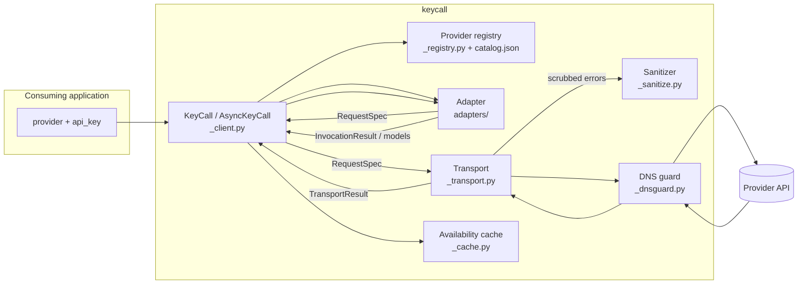

# Architecture

How KeyCall is put together: the layers a request passes through, the contracts between them, and the boundaries that keep credentials contained. For what the library does and how to call it, see [USAGE.md](https://github.com/shehuphd/keycall/blob/main/USAGE.md).

## Request flow



A call moves through four layers, each with one job:

1. The **client** binds identity (provider, credential, protocol, base URL) once at construction, drives pagination and caching, and owns tracing spans.
2. The **registry** resolves a provider name to a trusted endpoint profile from the bundled catalog, or validates an explicit custom target.
3. The **adapter** is pure: it turns a typed request into a `RequestSpec` (method, path, JSON body) and parses provider payloads back into normalized types. Adapters perform no I/O and never see the credential.
4. The **transport** executes specs over httpx, applies retry policy, caps response size, refuses redirects, and is the only layer that reveals the credential.

## Credential boundary

The raw key enters the library at a single point and is revealed at a single point:

```text
api_key (str) or credential (mapping of named fields)
  └─ KeyCall.__init__          wraps immediately in Credential (_credential.py)
       └─ Credential           redacted repr/str/format; refuses pickle/copy;
          .reveal(field)       called only by _transport._build_headers()
                               and the per-request JWT mint it calls
```

Everything between those two points handles the opaque `Credential` wrapper. A provider whose credential has more than one field (LiveKit's key/secret pair) declares its field names in the catalog, and the wrapper holds them all under the same rules — construction is refused by field name, never by value, when the mapping and the declaration disagree. Supporting rules:

- Adapters receive requests and payloads, never the credential.
- All provider-originated error text passes through `scrub()` (`_sanitize.py`) before entering a `KeyCallError`: every field of the active credential and its URL-/base64-encoded forms are replaced, credential-shaped patterns are redacted, control characters are stripped, and length is bounded.
- Provider-supplied request identifiers pass through `safe_request_id()` before entering results or errors.
- Cache identity uses an HMAC fingerprint of the key under a process-local secret, never the raw key or an unkeyed digest.
- Clients and credentials refuse `pickle`, `copy`, and `deepcopy` outright.

## Component contracts

| Component | Owns | Must never |
|---|---|---|
| `_client.py` | Identity binding, page loop, cache use, tracing spans, category filtering, the retired-model pre-flight gate and listing withholding | Expose the credential through any property or repr |
| `_registry.py` + `_catalog/catalog.json` | Name → endpoint/auth/operations resolution (text generation, embeddings, image generation, speech generation, video generation and status, batch generation, prerecorded and streaming transcription), provider kind (model vs service, with declared credential fields and probe-category endpoints), custom and required-at-construction base-URL validation, per-provider capability evidence (tool calling, web search, schema enforcement, media input forms, sampling and tool-choice constraints, seed support, video download hosts, prompt caching, batch support, rolling-alias conventions), each dated, and the retired-model records (id, alias spellings, retirement date, provider-named replacement, dated evidence note) | Accept credential-routing data from outside the bundled catalog |
| `adapters/` | Request building, response parsing, error translation, model classification evidence, the pre-flight sampling and seed gates | Perform I/O, see the credential, leak raw provider objects |
| `_transport.py` | HTTP and WebSocket execution, retries, size cap, redirect refusal, header construction, `DownloadPlan` enforcement | Retry generation, follow a redirect, emit unscrubbed provider text |
| `_realtime.py` | Sync/async realtime session sequencing over the transport's WebSocket wire | Perform I/O directly (the transport owns the socket) |
| `_transcription.py` | Sync/async streaming-transcription session sequencing over the same WebSocket wire | Perform I/O directly (the transport owns the socket) |
| `_sources.py` | Credential-source loading (TXT/JSON/TOML files, `env:` references), target parsing, git-exposure warnings on tracked key files | Write to, delete, or echo the contents of a credential file, or expose a key through a `Target` repr |
| `_dnsguard.py` | Per-request resolve-validate-pin for custom targets | Wrap named providers (their hostnames come from the catalog) |
| `_sanitize.py` | Credential scrubbing, request-id and display-name bounding | Depend on TraceAct for safety |
| `_cache.py` | Process-local TTL model cache keyed by provider + base URL + fingerprint | Persist to disk or outlive the process |
| `_verify_core.py` | The verify walk shared by CLI and viewer | Hide an attempt or fall through unreported |
| `_cli.py` | The `keycall` command: verify and view subcommands, the no-command welcome, plain-language usage errors with one confident suggestion, category-only color gated on a terminal and `NO_COLOR` | Echo a token that reads as a pasted key, or print a raw parser dump |
| `_classify.py` | Conservative model classification and `alias_fact()` rolling-alias facts, both from catalog evidence | Guess a category or an alias convention without recorded evidence |
| `_capabilities.py` | Typed capability lookups over the catalog's dated per-provider evidence | Answer from anywhere but the bundled catalog |
| `_credential.py` | The internal redacting credential wrapper, applied at client construction | Reveal the raw key through str, repr, or serialization |
| `_types.py` + `_enums.py` + `_errors.py` | The public surface's frozen records, closed enums, and typed error codes | Carry provider-specific structures or mutable state |
| `_tracing.py` | Optional TraceAct spans with every capture flag forced off and both redaction layers forced on | Capture prompts, responses, or credentials |

## Provider resolution

Provider identity and wire protocol are separate. The catalog maps twelve named providers onto eight protocols; the adapter is chosen by protocol, with named overrides for providers whose behavior diverges. The `stt` protocol has no protocol-level adapter: no generic STT-compatible wire exists the way OpenAI-compatible does, so its two providers resolve by name alone and custom targets cannot claim it. The `elevenlabs` protocol is single-vendor — one provider speaks that wire — and custom targets cannot claim it either, since they can only claim `openai-compatible`:

```text
provider name ──► catalog profile ──► protocol ──► adapter
  openai              openai            openai       OpenAIAdapter (Responses API)
  anthropic           anthropic         anthropic    AnthropicAdapter
  gemini              gemini            gemini       GeminiAdapter
  deepseek            openai-compatible              OpenAICompatibleAdapter
  moonshot            openai-compatible              MoonshotAdapter (override)
  perplexity          openai-compatible              PerplexityAdapter (override)
  xai                 openai-compatible              XAIAdapter (override)
  assemblyai          stt                            AssemblyAIAdapter (by name)
  deepgram            stt                            DeepgramAdapter (by name)
  elevenlabs          elevenlabs        elevenlabs   ElevenLabsAdapter
  google_maps         google_maps       google_maps  GoogleMapsAdapter (service)
  livekit             livekit           livekit      LiveKitAdapter (service)
  <custom> + base_url openai-compatible              OpenAICompatibleAdapter (is_custom)
```

The two service protocols are single-vendor the same way `elevenlabs` is, so custom targets cannot claim them. LiveKit's catalog entry declares `requires_base_url`: resolution refuses construction without the caller's per-project host (normalizing the dashboard's `wss://` spelling to `https://`), and that host passes the same custom-base-URL validation every explicit base URL gets.

An unknown name is an error unless the caller explicitly passes `protocol="openai-compatible"` with a validated HTTPS `base_url`. Custom targets get the DNS-rebinding guard; named providers route to catalog-maintained hostnames and don't. The guard fails closed against the environment too: a set proxy variable would route requests around it (the proxy resolves DNS itself), so constructing a guarded custom-target client with one set raises a typed error naming the resolutions (`trust_env=False`, `allow_private_network=True`, or unsetting the variable) rather than proceeding with the guard silently disabled.

## Service providers

A catalog entry with `kind: "service"` describes a provider with no models: instead of operations it declares `credential_fields` and `service_categories`, each category naming the method, host, and path of the cheapest request that answers it (dated notes carry the evidence and per-call pricing). `probe_services()` (`_client.py`) walks the adapter's per-category `RequestSpec`s under the `list` retry policy — every probe is an idempotent read — and the `ServiceProviderAdapter` hooks (`adapters/_base.py`) turn each response or translated error into a `ServiceStatus`: a credential-level failure (`INVALID_API_KEY`) re-raises for the whole probe, anything category-scoped becomes that category's standing. Model operations refuse on a service adapter naming `probe_services()`, and the service hooks refuse on a model adapter, so the two kinds can't be driven across each other.

Two transport pieces exist for this kind. `RequestSpec.host` overrides the request origin with a catalog-declared host, because Google Maps serves its categories from three hostnames under one credential — the override never takes caller input, so the credential still can't be routed anywhere the catalog doesn't name. And the `jwt_hs256` auth scheme mints a per-request HS256 token (stdlib only) from the credential pair inside `_build_headers`, keeping `Credential.reveal()` confined to the transport; grants ride `RequestSpec.jwt_grants`, the token expires in ten minutes, and nothing is cached.

## Retired models

The catalog carries a `retired_models` array per provider: shut-down model ids with their alias spellings, the retirement date where the provider publishes one, the provider-named replacement (chains through intermediate retired models resolved in the data, so a message never points at another dead model), and a dated evidence note. The client enforces it at two points, both before any network call: `_require_model_not_retired()` runs inside every spec builder and session opener (generation, streaming, images, speech, embeddings, video, batches per request, transcription both wires, realtime), raising `MODEL_RETIRED`; and `_store_discovery()` withholds recorded ids from listings at the one site both sync and async clients share, reporting each withholding twice from that site: a sentence in `ModelDiscovery.warnings` and a `WithheldModel` record in `ModelDiscovery.withheld`, so a reader that lays them out reads data rather than parsing prose. Both halves ride the availability cache, so a cached listing carries them too. Only behaviorally dead ids are recorded — a deprecated-but-serving model or a redirected legacy id is left alone — and two release-suite drift probes hold the data to that line: one replays every recorded id and alias against its provider raw and fails on any 200, the other checks every recorded replacement still appears in its provider's listing.

## Sampling and seed

`temperature`, `top_p`, and `seed` are request fields validated at two points. At construction, `TextGenerationRequest` bounds the ranges it can judge provider-blind (temperature 0–2, top_p in (0, 1], seed a non-negative int). At the adapter's `validate_generation_request`, which every generation build (sync, stream, and each batch item) passes through, two provider-specific gates run before any network call: `sampling_violation()` (`_capabilities.py`) refuses a `temperature`/`top_p` a model pins or rejects, reading the catalog's per-provider `sampling_constraints` and naming the one permitted value in the error; and a seed gate refuses `seed` on a provider whose catalog `supports_seed` is false, since dropping a seed the caller set to make a call repeatable would fake reproducibility. A supported seed is emitted on that provider's own wire (`generationConfig.seed` on Gemini, a top-level `seed` on the OpenAI-compatible body); xAI carries it on chat completions but refuses it alongside web search, reasoning effort, or code execution, which route through the Agent Tools API that has no seed field. Both gates rest on live-verified evidence dated in the catalog, and two release-suite drift probes re-verify that the seed-supporting providers still take a seed and the pinned models still reject a non-default temperature.

## Retry policy

Operation-aware, implemented in the transport:

- `list`: up to 2 retries for retryable failures (transient network, 429, 5xx), backoff 0.5 s then 1.5 s, extended by `Retry-After` (seconds or HTTP-date form) up to 30 s.
- `generation`: zero retries. No supported provider documents generation idempotency, so a retry after ambiguous transmission could double-charge.
- Non-retryable errors (auth, permission, 4xx) raise immediately under either policy.
- Video status polls and finished-file downloads use the `list` policy: both are idempotent reads. Starting a render uses `generation`, since a retry would start a second billable job.
- Batch jobs follow the same split: submitting (and any upload or container-create step before it) uses `generation`, while status polls and results downloads use `list`.

## Video generation

The package's first job-shaped operation: `start_video()` returns a `VideoJob` handle, `check_video()` polls it, `fetch_video()` downloads the finished asset, and `generate_video()` drives all three against a waiting budget. The adapter that parses a finished job declares a `DownloadPlan` (`_transport.py`) naming the exact hosts, redirect behavior, and whether the credential may be attached; the transport enforces it rather than trusting the URL a response names. Gemini's Veo needs the credential on a same-origin redirect hop; xAI's Grok Imagine serves finished files from an unsigned public host with no credential at all. Starting a render uses the `generation` retry policy, since a retry would start a second billable job, while polling and downloading use `list`, since both are idempotent reads.

## Batch generation

The second job-shaped operation, spread over five wire dialects. The client (`_client.py`) sequences one generic flow — an optional prelude (OpenAI and Moonshot upload a JSONL input file; xAI creates a named container), then submit, then poll/results/cancel — and each adapter maps its provider's dialect onto those hooks. Item bodies come from the adapter's own `build_generation_spec` (or the embedding builder), so a request inside a batch carries the same wire body, sampling gates included, that the same request would carry live. The client assigns each request a key, stores the keys on the serializable `BatchJob` handle, and reorders the provider's outcomes back to submission order at fetch time, since providers return them out of order. Per-request outcomes parse through the same response parsers the synchronous paths use; a failed request becomes a `BatchResult` error entry, never an exception. Anthropic's `results_url` is followed only when it stays on the provider's own API host, since the credential rides the download. The transport grew two pieces for this operation: multipart file upload on `RequestSpec` (`file_upload` + `form_fields`), and passthrough of JSONL and unparseable `text/*` success bodies as bytes, since batch results download as line-delimited JSON under `application/x-jsonl` (Anthropic), `application/octet-stream` (OpenAI), and `text/plain` (Moonshot).

## Prerecorded transcription

Two wire forms on one surface, each provider in its native one. OpenAI, ElevenLabs, and Deepgram answer in a single round trip through `build_transcription_spec`/`parse_transcription_response`; AssemblyAI is job-shaped (upload, submit, poll) through the job hook set, with `transcription_is_job_shaped` on the adapter saying which set applies. `transcribe()` covers both — one call on the sync providers (where a `timeout` argument is refused; the client's `read_timeout` is the knob), the polling wrapper on the job provider (where `timeout` is required, and running out raises `TranscriptionJobTimeout` carrying the still-valid handle) — while the job methods (`start_transcription`/`check_transcription`/`fetch_transcription`) exist only where a job exists provider-side. The URL-input and diarization gates read per-provider capability flags at their own grain, since support varies by fact, not by provider alone; word timings converge on the streaming surface's millisecond `TranscriptWord`, grown an additive `speaker` field. Diarization is two flags, not one, because the wires disagree within a provider: `transcription_diarization` covers the stored-file surface and `streaming_diarization` the socket, and ElevenLabs holds the first without the second (its realtime words carry a `speaker_id` it never fills), so a diarized session refuses there while a diarized file succeeds. Each streaming adapter asks in its own dialect — AssemblyAI `speaker_labels=true`, Deepgram `diarize=true` — and both translators stringify the label so one reader handles a letter and an integer index alike. Gemini's refusal points at `generate_text` + `AudioInput` rather than injecting a fixed instruction into prompted generation and calling the answer a transcript. The transport grew a raw binary request body (`RequestSpec.binary_body` — Deepgram's listen route and AssemblyAI's upload) and file-less multipart forms (ElevenLabs by `source_url`) for this operation. Catalog transcription models additionally carry per-model `wires` facts (streaming, prerecorded, or both, each with dated evidence), because the transcription model category alone can't say which wire a model serves — ElevenLabs runs one model per wire and refuses each on the other. Where a provider's transcription models come from live discovery instead of the catalog, there are no per-model `wires` to read, so the split rests on the id: `streaming_only_transcription_families` names the families that carry the transcription category but only the realtime socket serves (OpenAI's `gpt-live-transcribe`, `gpt-realtime-whisper`, which the stored-file endpoint answers with a bare 404), and `validate_transcription_request` refuses one on the stored-file surface with `MODEL_NOT_SUITABLE`, pointing at `transcribe_stream()`.

## Server-side tool continuation

Some providers run a tool server-side and hand the caller a tool call to echo back before the answer arrives, rather than returning a normal response: Moonshot's `$web_search` builtin is the first of these. The adapter hook `server_tool_continuation()` (default: refuse) recognizes its own provider's server-tool calls and builds the replayed assistant/user turns; the client (`_client.py`) runs the loop, bounded at `_SERVER_TOOL_ROUND_BUDGET` rounds, merging usage across rounds and hiding the handshake's intermediate stream events so the call reads like any other generation.

## Realtime sessions

Realtime keeps the same component boundaries over a WebSocket. The transport owns the connection: it builds the `wss://` URL from the catalog host (realtime paths are host-rooted, since the WebSocket endpoints don't live under the base URL's `/v1`-style prefix), attaches the auth header (the credential never enters a URL on any provider) and wraps the socket so close reasons are scrubbed before they can surface. Adapters own the two frame dialects (the Realtime API for OpenAI and xAI, `BidiGenerateContent` for Gemini) as pure translators: provider frames in, normalized `RealtimeEvent`s out, caller turns in, provider messages out, no I/O. `_realtime.py` sequences the two, and the sync and async sessions differ only in awaits.

Streaming transcription reuses this machinery with its own session and event types: the same transport wire (grown a binary `send_bytes` for raw PCM audio, and accepting a full `wss://` operation path for AssemblyAI's separate streaming host), the same header-auth rule (Deepgram adds a `token` auth scheme, `Token <key>`; ElevenLabs an `api_key` scheme, the bare key in its `xi-api-key` header), and pure per-provider translators in `adapters/_stt.py` and `adapters/_elevenlabs.py` turning provider frames into normalized transcription events. Translators own audio encoding through `encode_audio()`, because the wires differ: AssemblyAI and Deepgram take binary PCM frames, ElevenLabs takes JSON messages carrying base64 audio. ElevenLabs' server also never closes the socket after the final transcript, so its translator flags the session over and `_transcription.py` synthesizes the session-ended event itself. `_transcription.py` sequences it all the way `_realtime.py` does; the speech providers' every LLM operation refuses with a typed error, and vice versa.

## Prompt caching

`TextInput.cacheable` is a request-shape flag, not a new component: each adapter that acts on it does so inside its own `build_generation_spec`, the same place every other per-provider request difference already lives. Anthropic and OpenAI's explicit modes are the same inline shape (a marker on a content block, in the same request), so both are wired; Gemini's explicit mode is a separate stateful resource (`cachedContents.create`, referenced by name in a later call) rather than an inline marker, and is deliberately not wired — building it would mean KeyCall tracking a server-side handle across calls, breaking the stateless-per-call design every other request follows, for a provider whose automatic caching already works with no KeyCall involvement. The pre-flight gate for Anthropic's two TTL tiers lives in `_base.py`'s `validate_generation_request`, alongside every other provider-specific pre-flight check, so a caller learns about an unsupported TTL before any network call rather than from the provider's own 400.

## The viewer

`keycall view` starts a localhost-only stdlib HTTP server (`viewer/_server.py`). Credentials stay server-side in a `Registry` (`viewer/_registry.py`) that maps integer target ids to live clients; the browser only ever sends and receives target ids and `TargetView` records. The provider read timeout is a `Registry`-level setting, not fixed at client construction: `/api/settings` rebuilds every loaded key's client with a new value, retiring rather than closing the replaced client so a request already in flight keeps the timeout it started with. Every `/api/*` request requires a per-run token generated fresh at startup and never persisted. The frontend is dependency-free and builds DOM through `textContent` only, under a `default-src 'self'` content security policy. `viewer/_traces.py` holds an in-memory, process-lifetime log of request outcomes (timing and status, never prompts or replies) for the Traces tab. Each generation request still carries the whole conversation as `history`, which the server places before the current turn when it builds the provider request — the request/response cycle itself holds nothing between turns. A separate, session-scoped `Conversation` store on the `Registry` (`save_conversation`/`list_conversations`/`get_conversation`/`clear_conversations`, behind `/api/conversations*`) keeps a saved copy of each finished conversation's history and rendered transcript for the History pane, so a conversation survives a page reload; it mirrors what the browser already holds rather than replacing it as the source of truth for replay, and like every other in-memory registry state it is gone when the process stops.

File transcription in the Playground is one blocking POST (`/api/transcribe/file`) through the same `client.transcribe()` a library caller uses, the shape the video route already has: sync providers answer in the round trip, and the job-shaped provider is polled server-side within the same call, which supplies the timeout that wire requires. The two transcribe tasks share the transcription model category but not one wire, so their model pickers filter on the catalog's per-model wire facts (served in `/api/targets` as `transcription_wires`), and each gates its keys on its own wire's capability flag; speaker labels and link input gate per provider on their own flags the same way.

The Playground's two session tasks — voice conversation and live transcription — are the exceptions that hold state mid-turn: `/api/realtime` and `/api/transcribe` each upgrade the HTTP connection to a WebSocket, hand-rolled in `viewer/_ws.py` (RFC 6455 framing over the hijacked socket, no dependency added for it) rather than opened as a normal request/response. `viewer/_realtime_bridge.py` and `viewer/_transcription_bridge.py` then run for the life of their connection, translating the browser's small JSON control protocol into calls on a `RealtimeSession` or `TranscriptionSession` and normalized events back into JSON frames, one thread reading each direction. The server never buffers a transcript live: the browser holds the in-flight text alone and saves finished content to the Conversation store above — a voice conversation's turns stay browser-only, while a transcription session's finalized utterances are saved as they arrive, the same route every other Playground task's finished turns take.

Every tab has its own URL (`/models`, `/playground`, `/verify`, `/traces`, with `/` and `/dashboard` both the Dashboard): the server hands the same page shell to each of those paths, the page reads the path to pick the tab, and the printed `?token=` link performs its cookie handshake on any of them, redirecting back to the same path with the token stripped.

`--reload` restarts the server process when KeyCall's own source changes, keeping the bound port and the run token so an open browser tab survives the restart. The token and port pass through the environment rather than argv, invisible to `ps`. It's a development aid for working on KeyCall itself, not a viewer feature: an installed package never changes, so the watcher stays idle.

```text
browser ── token + target id ──► _server.py ──► _api.py ──► Registry ──► KeyCall client
        ◄─ JSON (TargetView, models, results; never a key) ◄─
```

## Error taxonomy

One exception type, `KeyCallError`, discriminated by a closed `ErrorCode` enum (invalid key, permission, rate limit, provider outage, network, timeout, malformed response, unsupported provider/operation, model availability, model retirement, catalog update required, model suitability). Codes, retryability, and the full table are in [USAGE.md](https://github.com/shehuphd/keycall/blob/main/USAGE.md).

